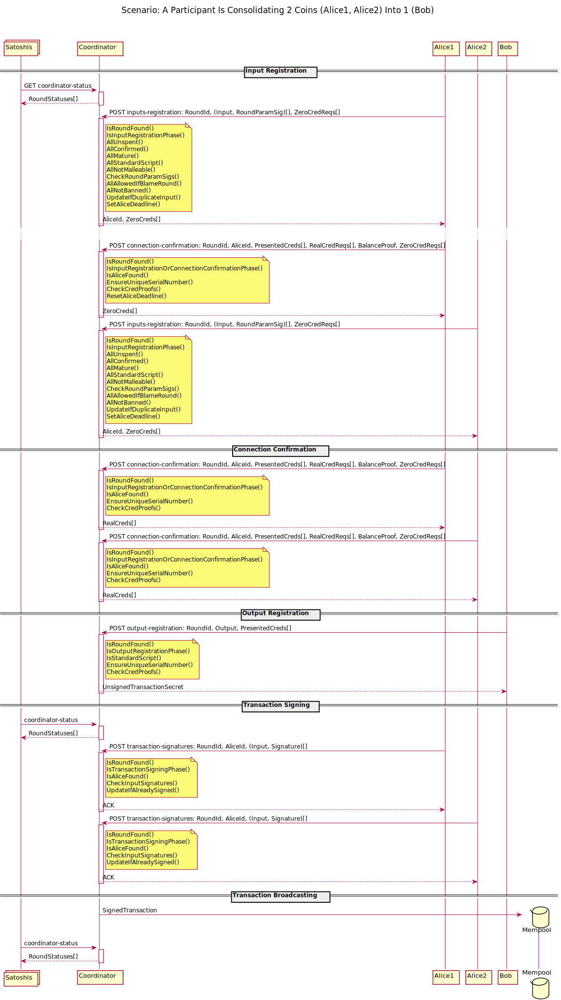
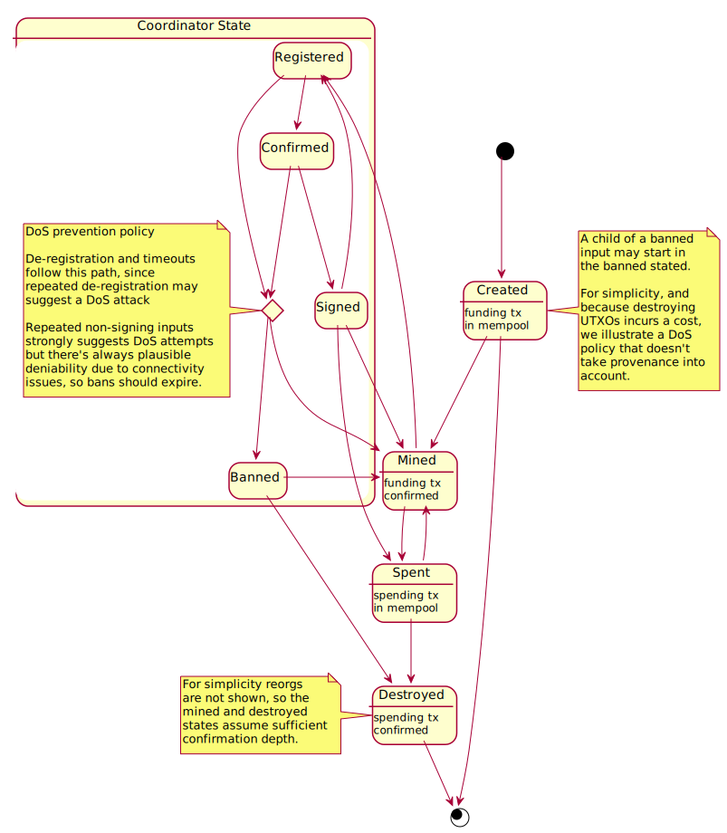

# Coordinated CoinJoin Protocol

This document describes a generic protocol based on WabiSabi for the
construction of CoinJoin transactions with the aid of a central coordinator.

Following ZeroLink terminology, a round is a single attempt at constructing a
valid bitcoin transaction (not to be confused with the number of rounds of
interactivity in the multiparty protocol).

Users who control unspent Bitcoin transaction outputs can participate in the
protocol to create a valid Bitcoin transaction that spends these UTXOs as
inputs creating new outputs, so that no direct link is observable between any
input and any output to the coordinator or the other participants.

This document does not address privacy preserving transaction structure, so
naive instantiations of the protocol may still reveal links inputs and outputs of
a single user (e.g. by amounts, script types, or address reuse).

## Roles

A single user assumes multiple roles in the protocol, each with its own anonymity network identity:

- Satoshi - used to obtain round information
- Alice - used for input registration (can be instantited multiple times per
  user)
- Bob - used for output registration (can be instantiated multiple times per
  user)

## Round Structure

Rounds are comprised of several phases which conclude when a condition is
satisfied or after a timeout.

1. **Input Registration** - Alices prove ownership of inputs to the coordinator,
   which issues credentials with zero value for use in mandatory credential
   presentations. Inputs must be periodically confirmed to remain registered.
   Input registration concludes when the maximum number of inputs has been
   registered, or after a timeout if the minimum number of inputs has been
   registered.
2. **Connection Confirmation** - To signal that input registration has concluded
   the coordinator responds to confirmation requests by issuing the requested
   credentials. This phase concludes when all inputs have been confirmed or
   after a timeout.
3. **Output Registration** - Bobs present credentials in order to register outputs.
   When there is no outstanding balance (all non-zero credentials have been
   presented) or after a timeout the round unconditionally advances to the
   signing phase.
4. **Transaction Signing** - Satoshis fetch the proposed transaction, and the
   Alices provide input signatures after confirming their output registrations
   have been included.  
5. **Transaction Broadcast** - The coordinator broadcasts the transaction and waits
   for confirmation in a block.

Timeouts are considered a failure except during input registration, where the
round may still proceed if a sufficient number of participants have joined.
Failure during any phase will cause the round as a whole to fail, apart from
output registration which unconditionally proceeds to the signing phase in
order to assign blame. Signed inputs reveal that a user executed the protocol
honestly, allowing faulty/malicious users to be excluded from a re-attempted
round.

Round metadata such as coordinator parameters for the WabiSabi credentials,
information is provided in responses to `coordinator-status` requests.

## Attacks

Due to the nature of CoinJoin transactions users don't need to trust other
users or the coordinator against theft, leaving denial of service and attacks
on privacy as the main concerns.

### Denial of Service

A user may disrupt the protocol by failing to provide a signature for an input
on the final transaction.

Such attacks can be mitigated by banning inputs that do not honestly
participate, which can increase the cost and liquidity requirement for a denial
of service attack.

Failure to confirm during input registration can generally be tolerated as it does not harm other users. However failure to confirm in connection confirmation phase cannot go without punishment, otherwise an attacker could make sure only small CoinJoins to take place. And once the connection confirmation phase times out the input set is finalized, and inputs for which a signature is not the subsequent transaction signing phase may be considered malicious.

### Attacks on Privacy

Attacks on privacy can be attempted by a passive observer, including a global
adversary performing traffic analysis, the coordinator, or a participant in the
protocol.

We assume that network level privacy tools and uniformity of the requests
account for traffic analysis based attacks, and that the structure of the
CoinJoin transaction provide sufficient privacy against passive observers.

This leaves Sybil attacks by other users or the coordinator, and attacks by the coordinator such as targeted denial of service by the coordinator for the purpose of deanonymization (e.g. facilitating an intersection attack on specific input or output registrations) or timing analysis. Sybil attacks by
users or the coordinator have a liquidity requirement cost requirements depending on Bitcoin network fees.

Mitigation of such attacks are beyond the scope of this protocol, as they
pertain to the specific transaction structure.

## Fees

Mining fees per registration can be specified as a linear function of the
weight units of the registration with specified precision and rounding
behaviour. If there is no constant term (fixed per input/output fee), then this
is just a conversion factor from weight units to satoshis, otherwise a pair of
numbers. Coordination fees can also be specified as a linear function of the
amount but may require a more detailed function. In either case the balance
proofs given by clients must take the fees into account.

If a more dynamic policy is needed the coordinator can adjust any credential
request upwards by simply tweaking the attribute commitment and returning the
adjustment amount as an integer along with the issued credentials. This can
only be safely used to increase the issued credential amounts, since negative
adjustments may result in credentials with negative amounts using the normal
range proofs which only ensure requested values are greater or equal to zero.

## Interaction Diagram

The following diagram illustrates the messages of a single user during the
course of a round.

The Interaction Diagram denotes Satoshi actors those are polling the Coordinator with `coordinator-status` requests. Satoshis are not only participants of the round, but they are any wallet users. This mitigates information learned by the Coordinator about participants of the coinjoins. The coordinator responds with a json that currently only contains a single element: an array of round statuses: `RoundStatuses`. Each `RoundStatus` corresponds to an alive round and have the following structure:

- `Phase`
- `RoundId`
- `PhaseDeadline`
- `BlameOf` - If it's a blame round, then it is the `RoundId` of the parent round.
- `PhaseStatus` - What else the response contains depends on the current phase.

### `PhaseStatus` in InputRegistration

- `CredentialIssuerParams` - 2 public curve points (C_w, I)
- `RegisteredInputCount`
- `MaxRegisteredInputCount`
- `FeeRate`
- `ReconfirmationTimeout`

#### `RoundParams`

For input registration the user submits a `RoundParamsSig`, which is a signature on the hash of the `RoundParams`. It is used to 
- prove ownership of an input
- prove spendability of an input
- ensure every other participant in the round got the same `RoundParams`, thus the coordinator cannot fingerprint them by giving out different parameters to different users.

`RoundParams` consists of `RoundId`, `BlameOf`, `CredentialIssuerParams` and `FeeRate`.

### `PhaseStatus` in ConnectionConfirmation

- `ConfirmedInputCount`
- `MaxConfirmedInputCount`
- `Inputs` AND `RoundParamsSigs` - Round parameter signatures corresponding to inputs. Client can check the validity before confirming connection. If this check takes too long (for example because of RPC calls) then the client would be punished, but it the round could progress just fine.

### `PhaseStatus` in OutputRegistration

- `RegisteredOutputCount`
- `RegisteredOutputVolume`
- `TotalInputVolume`

### `PhaseStatus` in TransactionSigning

- `SignedInputCount`
- `MaxSignedInputCount`
- `EncryptedUnsignedCoinJoin`

#### `EncryptedUnsignedCoinJoin`

When a participant registers an output, the coordinator gives an `UnsignedTransactionSecret` as response. With this, during the signing phase, the participant can decrypt the `EncryptedUnsignedCoinJoin` to sign it. This ensures only the participants of a round learn the CoinJoin before it is broadcasted. This feature is not strictly necessary.

### `PhaseStatus` in TransactionBroadcasting

- `CoinJoin`

## Round State Diagram

The following diagram shows the coordinator's state transitions for a specific
round.

## Per-Input State Diagram

The following shows the coordinator's state transitions pertaining to a
specific UTXO, possibly spanning multiple rounds.

## Network Identity State Diagram

The following diagram shows the client's state transitions for a specific
identity. Once an identity reaches the terminal state the identity must no longer
be used. If a connection is broken a new identity may be used to submit
subsequent requests related to the same input (connection confirmations,
signature). Therefore at most one input or output should be associated with a
single network identity to avoid privacy leaks, but multiple network identities
may be associated with a single input or output.

